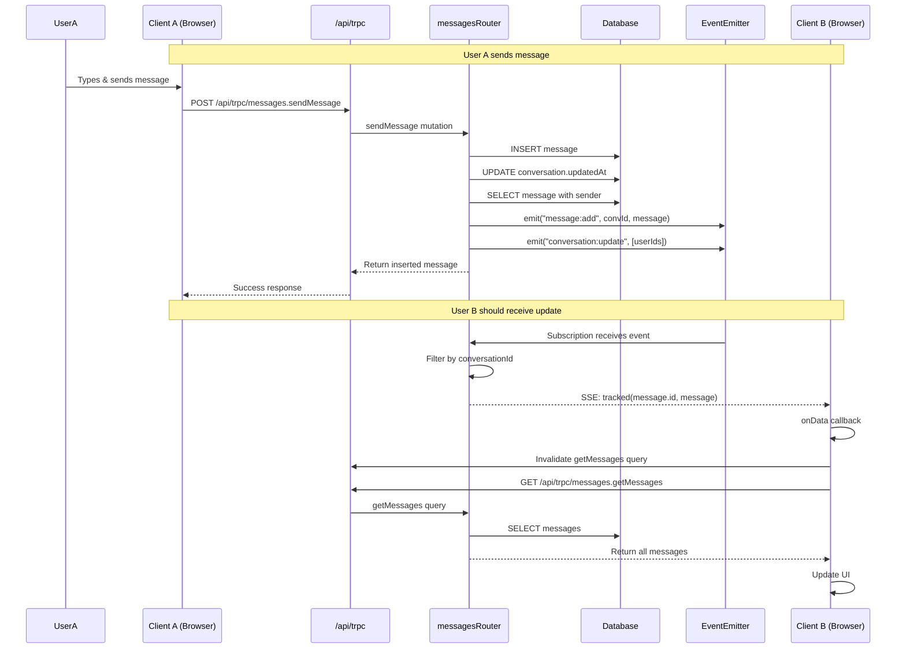

# Real-Time Messages Flow Analysis

## Current Flow Diagram



## Critical Issues Found

### Issue 1: Subscription Fetches ALL Messages on First Connect

**Location**: `features/messages/api/messages.router.ts` line 361-379

**Problem**: When `lastEventId` is NOT provided (first subscription), the code fetches ALL messages for the conversation:

```typescript
const newSinceLast = await db.query.messages.findMany({
  where: lastMessageCreatedAt
    ? and(...)  // Only when lastEventId exists
    : eq(messages.conversationId, conversationId),  // ❌ Fetches ALL messages!
  ...
})
```

**Impact**: 
- On first subscription, ALL existing messages are re-sent via SSE
- Creates duplicates in the UI
- Wastes bandwidth and causes flickering

**Fix**: Only fetch messages created AFTER subscription starts, or skip catch-up entirely if `lastEventId` is missing (rely on `getMessages` query for initial load).

### Issue 2: Race Condition - Subscription Starts After DB Query

**Location**: `features/messages/api/messages.router.ts` line 349-379

**Problem**: The subscription listens to events AFTER querying the database:

```typescript
const iterable = on(messagesEmitter, "message:add", { signal })  // Start listening
// ... then query DB for missed messages
const newSinceLast = await db.query.messages.findMany(...)
// ... yield missed messages
// ... then listen to new events
for await (const [convId, msg] of iterable) { ... }
```

**Impact**: If a message is sent between when we query and when we start listening, it could be:
- Missed entirely (if it arrives before we start listening)
- Sent twice (if it's in DB query AND arrives as event)

**Fix**: Start listening FIRST, then query DB. This matches the tRPC SSE example pattern.

### Issue 3: EventEmitter May Not Work in Serverless

**Location**: `features/messages/lib/messages.emitter.ts`

**Problem**: EventEmitter is in-memory. In serverless (Vercel, etc.), each function invocation might be a different process, so events won't propagate between instances.

**Impact**: Real-time updates only work within the same server instance. Cross-instance updates fail silently.

**Fix**: Use a shared state solution (Redis pub/sub, database polling fallback, or ensure single-instance deployment).

### Issue 4: Missing Error Handling in Subscriptions

**Location**: `features/messages/api/use-messages-subscriptions.ts`

**Problem**: No `onError` handler. If subscription fails, it fails silently.

**Impact**: Users don't know when real-time updates stop working.

**Fix**: Add `onError` handlers with logging and fallback to polling.

### Issue 5: lastMessageId Might Be Stale

**Location**: `app/(site)/messages/page.tsx` line 60

**Problem**: `lastMessageId: messages?.at(-1)?.id` uses current messages array. If messages haven't loaded yet or are stale, wrong `lastEventId` is sent.

**Impact**: Subscription might miss messages or fetch wrong range.

**Fix**: Only pass `lastMessageId` when messages are loaded and fresh.

### Issue 6: Manual Refetch After Send (Redundant)

**Location**: `app/(site)/messages/page.tsx` line 108-109

**Problem**: After `sendMessage`, code manually refetches:
```typescript
await messagesQuery.refetch()
await getConversations.refetch()
```

**Impact**: 
- Mutation already invalidates these queries
- Subscription will also invalidate them
- Triple refetch is wasteful

**Fix**: Remove manual refetches; rely on mutation invalidation + subscription.

## Recommended Fixes

### Fix 1: Correct Subscription Catch-Up Logic

```typescript
onNewMessage: protectedProcedure
  .subscription(async function* (opts) {
    // Start listening FIRST (don't miss events)
    const iterable = on(messagesEmitter, "message:add", {
      signal: opts.signal,
    }) as AsyncIterable<[string, MessageWithSender]>

    let lastMessageCreatedAt: Date | null = null
    
    // Only fetch missed messages if lastEventId is provided
    if (opts.input.lastEventId) {
      const lastMsg = await db.query.messages.findFirst({
        where: eq(messages.id, opts.input.lastEventId),
      })
      lastMessageCreatedAt = lastMsg?.createdAt ?? null
      
      if (lastMessageCreatedAt) {
        // Fetch ONLY messages created after lastMessageCreatedAt
        const newSinceLast = await db.query.messages.findMany({
          where: and(
            eq(messages.conversationId, opts.input.conversationId),
            gt(messages.createdAt, lastMessageCreatedAt)
          ),
          orderBy: [asc(messages.createdAt)],
          with: { sender: { columns: {...} } },
        })
        
        for (const msg of newSinceLast) {
          yield tracked(msg.id, msg)
          lastMessageCreatedAt = msg.createdAt
        }
      }
    }
    // If no lastEventId, skip catch-up (getMessages query handles initial load)

    // Now listen for new events
    for await (const [convId, msg] of iterable) {
      if (convId !== opts.input.conversationId) continue
      if (lastMessageCreatedAt && msg.createdAt <= lastMessageCreatedAt) continue
      yield tracked(msg.id, msg)
      lastMessageCreatedAt = msg.createdAt
    }
  })
```

### Fix 2: Add Error Handling

```typescript
trpc.messages.onNewMessage.useSubscription(
  conversationId ? { conversationId, lastEventId: lastMessageId ?? undefined } : skipToken,
  {
    ...(conversationId && { enabled: true }),
    onData: () => {
      void utils.messages.getConversations.invalidate()
      void utils.messages.getMessages.invalidate()
    },
    onError: (error) => {
      console.error("Message subscription error:", error)
      // Optionally: fallback to polling or show user notification
    },
  }
)
```

### Fix 3: Remove Redundant Refetches

Remove manual `refetch()` calls after mutations - invalidation + subscription handles updates.

### Fix 4: Ensure lastMessageId is Fresh

Only pass `lastMessageId` when messages are loaded:
```typescript
lastMessageId: messages && messages.length > 0 ? messages.at(-1)?.id : undefined
```

## Testing Checklist

- [ ] User A sends message → User B receives immediately (no manual refresh)
- [ ] User B sends message → User A receives immediately
- [ ] Both users in same conversation → both see updates
- [ ] User disconnects/reconnects → catches up missed messages
- [ ] File upload → both users see file appear
- [ ] File delete → both users see file disappear
- [ ] New conversation created → appears in both users' lists
- [ ] No duplicate messages on subscription start
- [ ] No duplicate messages on reconnect
