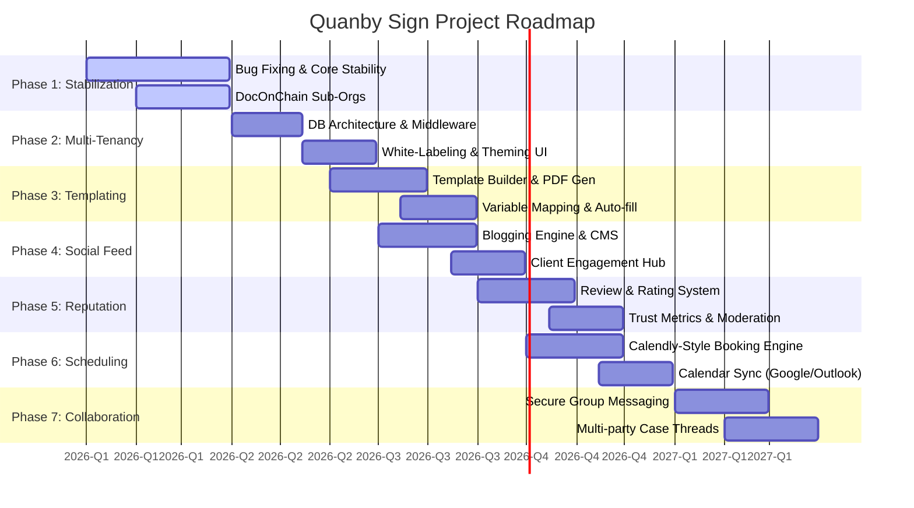
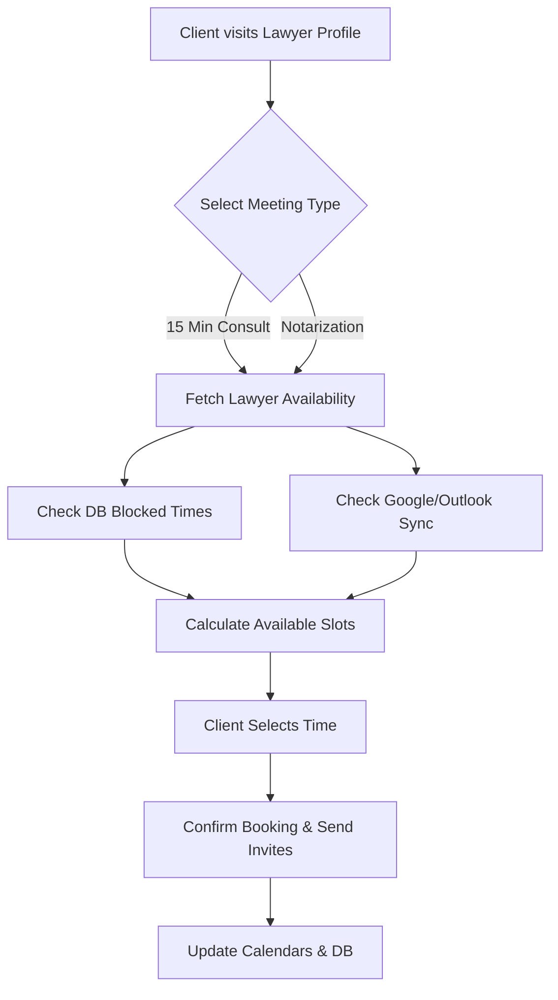

# Quanby Sign - Detailed Project Roadmap & Timeline

This document outlines the strategic roadmap, technical implementation details, and timeline for the future development of the Quanby Sign platform. It details the transition from our current stabilization phase into a comprehensive, multi-tenant legal ecosystem with advanced scheduling, social features, and collaboration tools.

## Visual Timeline

---

## Phase 1: Stabilization & DocOnChain Integration

**Timeline:** Q1 2026 (Current)

**Focus:** System reliability and foundational blockchain integration.

- **Bug Fixing & Stabilization:**
  - Resolve edge cases in the e-notary video session flow (Video SDK stability).
  - Optimize database queries (Drizzle ORM) for faster dashboard loading.
  - Enhance error handling and user feedback across the application.
- **DocOnChain Sub-Organizations:**
  - **Implementation:** Map Quanby Sign law firms to DocOnChain sub-organizations.
  - **Technical Detail:** Update the backend to interact with the DocOnChain API to provision sub-orgs dynamically when a new firm registers.
  - **Smart Contracts:** Ensure document hashes are correctly attributed to the specific sub-organization for auditability.
  - _Internal Reference:_ [DocOnChain Sub-Organizations](doconchain-sub-organizations.md)
  - _External Reference:_ [DocOnChain API Documentation](https://doconchain.readme.io/reference)

---

## Phase 2: Multi-Tenancy & White-Labeling

**Timeline:** Q2 2026

**Focus:** Empowering law firms with customized, branded experiences.

- **Firm-Level Multi-Tenancy:**
  - **Database Architecture:** Introduce `tenant_id` (firm ID) across relevant Drizzle schema tables (users, documents, sessions) to ensure strict data isolation.
  - **Routing:** Implement Next.js middleware to handle subdomain routing (e.g., `smithlaw.quanbysign.com`).
- **Customization Engine (White-Labeling):**
  - **Theming:** Allow firms to upload their logo and define primary/secondary brand colors.
  - **Implementation:** Dynamically inject CSS variables or Tailwind configuration overrides based on the active tenant context.
  - **Email Customization:** Branded email notifications (via React Email) sent on behalf of the specific law firm.

---

## Phase 3: Document Templating Engine

**Timeline:** Q2 - Q3 2026

**Focus:** Streamlining document creation and standardizing legal forms.

- **Reusable Templates:**
  - **UI/UX:** Build a drag-and-drop template builder interface.
  - **Storage:** Save template structures in Supabase, allowing firms to maintain a library of standard contracts, NDAs, and affidavits.
- **Variable Mapping & Auto-fill:**
  - **Dynamic Fields:** Support syntax like `{{client_name}}` or `{{lawyer_bar_number}}` within templates.
  - **Automation:** Automatically populate these fields using data from the user's profile or the specific case file before generating the final PDF for signature.

---

## Phase 4: Social & Content Feed

**Timeline:** Q3 2026

**Focus:** Building community and establishing lawyer authority.

- **Blogging-Style Feed:**
  - **CMS Features:** Integrate a rich text editor allowing lawyers to draft, format, and publish legal articles, case studies, or firm updates.
  - **SEO Optimization:** Ensure public-facing articles are SSR-rendered via Next.js for search engine discoverability.
- **Client Engagement:**
  - **Feed Algorithm:** Create a personalized feed for clients based on the firms they follow or legal topics they are interested in.
  - **Interactions:** Support basic engagement metrics (likes, bookmarks, shares).

---

## Phase 5: Reputation System

**Timeline:** Q3 - Q4 2026

**Focus:** Fostering trust and accountability on the platform.

- **Two-Way Reviews:**
  - **Client to Lawyer:** Clients can rate their experience (1-5 stars) and leave written feedback after a completed notarization or consultation.
  - **Lawyer to Client:** Internal ratings to flag problematic clients (no-shows, abusive behavior).
- **Trust Metrics & Moderation:**
  - **Public Profiles:** Display aggregated ratings and verified reviews on the lawyer's public profile.
  - **Admin Tools:** Build a moderation dashboard for Quanby admins to handle review disputes and remove inappropriate content.

---

## Phase 6: Advanced Scheduling & Availability

**Timeline:** Q4 2026

**Focus:** Frictionless booking and calendar management.

- **Calendly-Style Booking:**
  - **Custom Links:** Generate unique booking URLs for lawyers (e.g., `quanbysign.com/book/john-doe/15min`).
  - **Timezone Math:** Automatically convert lawyer availability into the client's local timezone.
- **Calendar Blocking & Sync:**
  - **Integrations:** Use OAuth to sync with Google Calendar API and Microsoft Graph API (Outlook).
  - **Conflict Prevention:** Automatically block slots if an event is added to the lawyer's external calendar.
  - **Rules:** Support buffer times (e.g., 10 mins between meetings), minimum notice periods, and daily limits.
  - _External Reference:_ Inspired by [Calendly](https://calendly.com/)

---

## Phase 7: Group Conversations & Collaboration

**Timeline:** Q1 2027

**Focus:** Complex case management and multi-party communication.

- **Secure Group Messaging:**
  - **Real-time Chat:** Upgrade the existing messaging system using Supabase Realtime (WebSockets) to support instant group chats.
  - **Threads:** Organize conversations by "Case" or "Envelope" rather than just 1-on-1.
- **Stakeholder Collaboration:**
  - **Participants:** Allow the principal, multiple witnesses, lawyers, and the notary to communicate in a single thread.
  - **File Sharing:** Securely share draft documents within the chat.
  - **Auditability:** Ensure all messages are permanently logged and exportable for legal compliance and dispute resolution.

---

_Note: Timelines are estimates and subject to change based on shifting business priorities and technical requirements._
