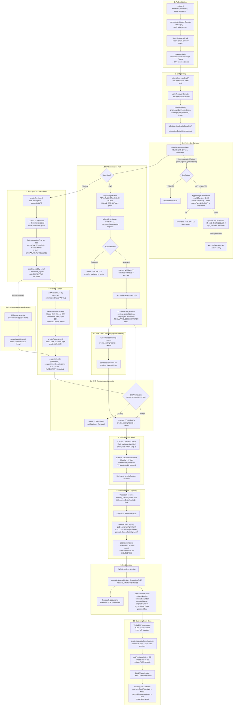

# Quanby Legal — Technical System Flow

```mermaid
flowchart TD
    subgraph Auth["1. Authentication"]
        A["register()<br/>firstName, lastName, email, password"] --> B["generateVerificationToken()<br/>24h expiry → verification_tokens"]
        B --> C["User clicks email link<br/>→ users.emailVerified = now()"]
        C --> D["NextAuth login<br/>email/password or Google OAuth<br/>→ JWT session cookie"]
    end

    subgraph Onboard["2. Onboarding"]
        D --> E["submitRecoveryEmail()<br/>→ recoveryEmail, token sent"]
        E --> F["verifyRecoveryEmail()<br/>→ recoveryEmailVerified"]
        F --> G["updateProfile()<br/>phoneNumber, homeStreet,<br/>barangay, cityProvince, image"]
        G --> H["isOnboardingDetailsComplete()<br/>→ onboardingDetailsCompletedAt"]
    end

    H --> I["User browses site freely<br/>/dashboard, /browse, /messages"]

    subgraph KYC["3. KYC — On-Demand"]
        I -->|"Accesses gated feature<br/>(book, upload, join session)"| J{"kycStatus?"}
        J -->|NOT_STARTED| K["HyperVerge Verification<br/>readIdCard() → OCR<br/>checkLiveness() → selfie<br/>matchFaceSelfieToId() → face match"]
        K -->|pass| L["kycStatus = VERIFIED<br/>id_card_details populated<br/>kyc_sessions recorded"]
        K -->|fail| M["kycStatus = REJECTED<br/>User retries"]
        L -->|"14 days unused"| N["kycLastExpiredAt set<br/>Must re-verify"]
        J -->|VERIFIED| O["Proceed to feature"]
    end

    I --> P{"User Role?"}

    subgraph ENP_Path["4. ENP Commission Path"]
        P -->|ENP| Q["Legal Registration<br/>PTR#, RAN, IBP#, MCLE#, ULAS#<br/>Upload: OBC, IBP cert, photo"]
        Q --> R["submit() → status = SUBMITTED<br/>electronicSignatureUrl required"]
        R --> S{"Admin Review"}
        S -->|Approved| T["status = APPROVED<br/>commissionStatus = ACTIVE"]
        S -->|Rejected| U["status = REJECTED<br/>remarks captured → revise"]
        T --> V["LMS Training (Modules 1-5)"]
        V --> W["Configure enp_profiles<br/>pricing, specializations,<br/>languages, availability<br/>(REGULAR/BLOCKED/CUSTOM slots)"]
    end

    subgraph Principal_Path["5. Principal Document Flow"]
        P -->|Principal| X["createEnvelope()<br/>title, description → status=DRAFT"]
        X --> Y["Upload to Supabase<br/>→ documents record<br/>name, type, size, path"]
        Y --> Z["Set notarizationType per doc<br/>ACKNOWLEDGMENT | AFFIRMATION<br/>JURAT | SIGNATURE_WITNESSING"]
        Z --> AA["addSigners() by email<br/>→ document_signers<br/>role: PRINCIPAL | WITNESS"]
    end

    subgraph Booking["6. Browse & Book"]
        AA --> AB["getAvailableENPs()<br/>role=ENP, commissionStatus=ACTIVE"]
        AB --> AC["findBestMatch() scoring:<br/>Rating 25% | Speed 20%<br/>Experience 20% | Spec 15%<br/>Workload 20% + boosts"]
        AC --> AD["createAppointment()<br/>enpId, date, duration, type,<br/>mode: REN | IEN"]
        AD --> AE["→ appointments (PENDING)<br/>→ appointment_participants<br/>HOST=ENP, PARTICIPANT=Principal"]
    end

    subgraph ChatBooking["6a. In-Chat Appointment Request"]
        AA -->|"from /messages"| CB1["Either party sends<br/>appointment request in chat"]
        CB1 --> CB2["createAppointment()<br/>linked to conversation thread"]
        CB2 --> AE
    end

    subgraph ENP_Review["6b. ENP Reviews Appointments"]
        AE --> ER1{"ENP reviews in<br/>/appointments dashboard"}
        ER1 -->|"accept"| AF["status = CONFIRMED<br/>createMeetingRoom() → roomId"]
        ER1 -->|"decline"| ER2["status = DECLINED<br/>notification → Principal"]
        W --> ER1
    end

    subgraph DirectSession["6c. ENP Direct Session (Bypass Booking)"]
        W --> DS1["ENP creates meeting directly<br/>createMeetingRoom() → roomId"]
        DS1 --> DS2["Send session invite link<br/>to client via email/chat"]
        DS2 --> AF
    end

    subgraph PreSession["7. Pre-Session Checks"]
        AF --> AG["STEP 1: Liveness Check<br/>Each participant verified<br/>(must pass before Step 2)"]
        AG --> AH["STEP 2: Geolocation Check<br/>Must be in PH or<br/>PH embassy/consular<br/>VPN detected & blocked"]
        AH --> AI["Both pass → Join Session enabled"]
    end

    subgraph Session["8. Video Session + Signing"]
        AI --> AJ["VideoSDK session<br/>meeting_messages for chat<br/>isDocumentOrderLocked = false"]
        AJ --> AK["ENP locks document order"]
        AK --> AL["DocOnChain Signing:<br/>getDoconchainApiToken()<br/>addDoconchainProjectSigner()<br/>generateDoconchainSignLink()"]
        AL --> AM["Each signer signs<br/>→ timestamp, IP, user agent<br/>→ document status = COMPLETED"]
    end

    subgraph PostSession["9. Post-Session"]
        AM --> AN["ENP clicks End Session"]
        AN --> AO["populateNotarialRegistryOnMeetingEnd()<br/>→ notarial_acts record created"]
        AO --> AP["ENP: /notarial-book<br/>registryNumber, certificateNumber,<br/>principalName, enpRollNumber,<br/>signersData JSON, passportData"]
        AO --> AQ["Principal: /documents<br/>Notarized PDF + certificate"]
    end

    subgraph SC_Sync["10. Supreme Court Sync"]
        AP --> AR["Verify ENP commission<br/>POST /public-use/cs<br/>{npn, rn} → Active"]
        AR --> AS["createMetadataConsolidated()<br/>Normalize NPN-, NFN-, RN- prefixes"]
        AS --> AT["getPresignedUrl() → S3<br/>uploadFileToS3()<br/>registerFileMetadata()"]
        AT --> AU["POST /notarization<br/>→ NRID + NRN returned"]
        AU --> AV["notarial_acts updated:<br/>supremeCourtRegistryId = NRID<br/>syncedToSupremeCourt = true<br/>syncedAt = now()"]
    end
```
