# Quanby Legal — System Flow

```mermaid
flowchart TD
    subgraph Register["Create Account"]
        A["Sign up with name,<br/>email & password"] --> B["Verify email<br/>(check inbox, click link)"]
        B --> C["Log in"]
    end

    subgraph Onboard["Set Up Profile"]
        C --> D["Add recovery email"]
        D --> E["Fill in phone, address<br/>& profile photo"]
    end

    E --> F["Browse the platform freely<br/>(dashboard, ENP directory, messages)"]

    subgraph KYC_Gate["Identity Verification (On-Demand)"]
        F -->|"Try to book, upload,<br/>or join a session"| G{"Already verified?"}
        G -->|No| H["Upload government ID<br/>+ take a selfie"]
        H --> I["System verifies identity"]
        I -->|Verified| J["Continue to feature"]
        I -->|Failed| K["Try again"]
        G -->|Yes| J
    end

    J --> L{"What's your role?"}

    subgraph Client["Client (Principal)"]
        L -->|Client| M["Upload documents"]
        M --> N["Choose notarization type<br/>(Acknowledgment, Jurat,<br/>Affirmation, or<br/>Signature Witnessing)"]
        N --> O["Add signers & witnesses"]
    end

    subgraph Find_ENP["Find a Notary"]
        O --> P{"How to find?"}
        P -->|"Browse & Pick"| Q["Search ENP directory<br/>Filter by specialty, rating,<br/>language, availability"]
        P -->|"Quick Match"| R["System finds best<br/>available ENP for you"]
        P -->|"Message First"| S["Chat with an ENP<br/>before booking"]
        Q --> T["Book appointment"]
        R --> T
        S --> T
        S -->|"Request from chat"| T2["Either party requests<br/>appointment mid-conversation"]
        T2 --> T
    end

    subgraph ENP_Setup["Notary (ENP) Setup"]
        L -->|ENP| U["Submit legal credentials<br/>(bar license, IBP, MCLE, etc.)"]
        U --> V{"Admin review"}
        V -->|Approved| W["Complete training"]
        V -->|Rejected| X["Revise & resubmit"]
        W --> Y["Set pricing, specializations<br/>& availability"]
    end

    subgraph ENP_Review["ENP Reviews Appointment"]
        T --> T3{"ENP decision"}
        T3 -->|Accept| Z["Appointment confirmed"]
        T3 -->|Decline| T4["Client notified —<br/>find another ENP"]
    end

    subgraph Direct_Session["ENP Creates Session Directly"]
        Y --> DS1["ENP creates session<br/>& sends invite link to client"]
        DS1 --> Z
    end

    Y --> T3

    subgraph Pre_Session["Before Joining"]
        Z --> AA["Step 1: Liveness check<br/>(prove you're real & present)"]
        AA --> AB["Step 2: Location check<br/>(must be in Philippines<br/>or at PH embassy)"]
        AB --> AC["Join Session button enabled"]
    end

    subgraph Session["Video Notarization Session"]
        AC --> AD["Join video call<br/>(ENP + Client + Witnesses)"]
        AD --> AE["ENP presents documents<br/>one by one"]
        AE --> AF["Each person signs<br/>in order"]
        AF --> AG["ENP applies<br/>notarial seal"]
    end

    subgraph After["After the Session"]
        AG --> AH["ENP ends session"]
        AH --> AI["Client receives notarized<br/>documents in 'Documents'"]
        AH --> AJ["ENP receives entry in<br/>'Notarial Registry'"]
        AJ --> AK["Registry synced to<br/>Supreme Court"]
        AK --> AL["Done ✓<br/>Audit trail available"]
    end
```

> **Roles**: Client (Principal) = person needing documents notarized. ENP = Electronic Notary Public. Witness = person who observes signing.
>
> **Session modes**: REN (everyone joins via video), IEN (everyone meets in person), Hybrid (mix of remote and in-person).
>
> **KYC** = one-time identity verification, prompted only when needed. **Liveness** = real-time check before every session.
