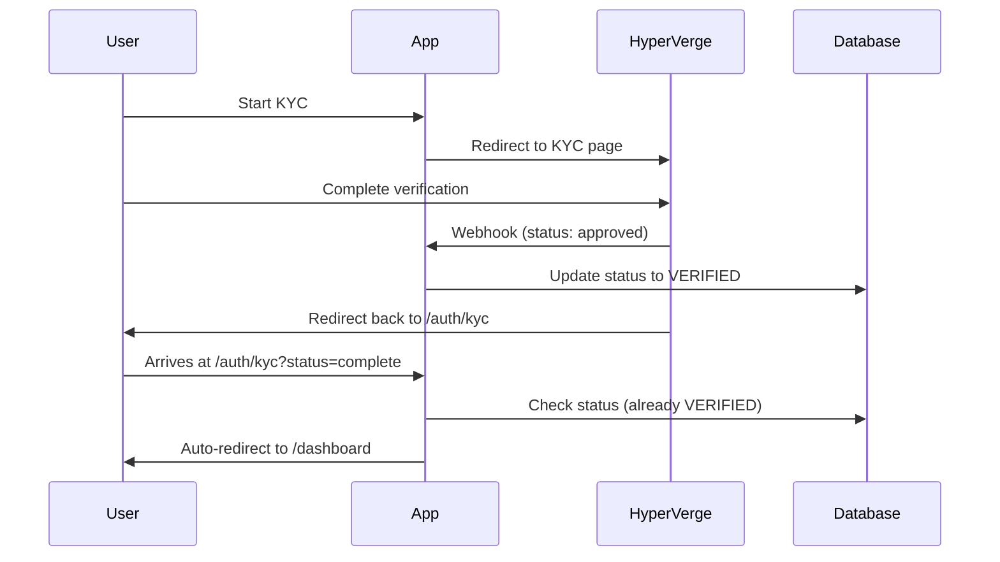
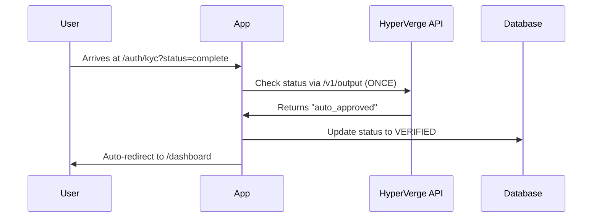

# ✅ HyperVerge Best Practices Implementation - Complete

## 📋 Summary of Changes

### What Was Wrong ❌

1. **Polling implementation** - Made repeated calls to `/v1/output` every 10-60 seconds
2. **Early status checks** - Checked status before KYC was complete
3. **No webhook** - Missing the recommended notification method
4. **Manual redirect issue** - User had to manually check status to trigger redirect

### What's Fixed Now ✅

#### 1. Webhook Endpoint Created

**File:** `app/api/webhooks/hyperverge/route.ts`

- Receives real-time notifications from HyperVerge
- Automatically updates database when KYC completes
- Handles all status types (approved/declined/needs_review)

#### 2. Webhook Utilities

**File:** `services/hyperverge/webhook.ts`

- Signature verification (for future use)
- Payload parsing
- Status interpretation

#### 3. Removed All Polling

**File:** `features/kyc/components/kyc-verification-card.tsx`

- ❌ Deleted `startPolling()` function
- ❌ Deleted `stopPolling()` function
- ❌ Removed polling state variables
- ❌ Removed exponential backoff logic

#### 4. Single Status Check + Auto-Redirect

**File:** `features/kyc/components/kyc-verification-card.tsx`

- ✅ After HyperVerge redirect → Check status ONCE
- ✅ If VERIFIED → Auto-redirect to `/dashboard` (1.5s delay)
- ✅ If REJECTED → Show error message
- ✅ If PENDING → Show message about waiting for webhook
- ✅ Manual check button as fallback only

#### 5. Setup Documentation

**File:** `features/kyc/WEBHOOK_SETUP.md`

- Complete webhook configuration guide
- Troubleshooting tips
- Monitoring instructions

## 🎯 Your Specific Issue - SOLVED

### Before:

```
User completes KYC → Redirects to /auth/kyc → Shows "PENDING"
→ User clicks manual check → Gets "VERIFIED" → Redirects to dashboard
```

### After:

```
User completes KYC → Redirects to /auth/kyc
→ Auto-checks status ONCE → Sees "VERIFIED"
→ Auto-redirects to dashboard (1.5s)
```

### Why It Works Now:

1. **Single check after redirect** - Immediately checks status when redirected
2. **Auto-redirect logic** - Automatically goes to dashboard when verified
3. **Webhook backup** - If webhook arrived first, status is already in DB
4. **No polling** - Follows HyperVerge best practices

## 🔧 Next Steps - Setup Webhook

### 1. Configure in HyperVerge Dashboard

```
1. Go to: https://dashboard.hyperverge.co
2. Settings → Webhooks
3. Add webhook URL: https://your-domain.com/api/webhooks/hyperverge
4. Enable "Results" event
5. Save
```

### 2. Test Locally (Optional)

```bash
# Use ngrok for local testing
ngrok http 3000

# Update HyperVerge dashboard with ngrok URL:
# https://abc123.ngrok.io/api/webhooks/hyperverge
```

### 3. Deploy and Verify

```bash
# After deployment, test endpoint:
curl https://your-domain.com/api/webhooks/hyperverge

# Should return:
# {"status":"ok","message":"HyperVerge webhook endpoint is ready"}
```

## 📊 How It Works Now

### Normal Flow (With Webhook)



### Fallback Flow (If Webhook Delayed)



## ✅ Best Practices Compliance

### ✓ What HyperVerge Wants

- [x] Webhook for notifications (PRIMARY)
- [x] Single status check after completion (FALLBACK)
- [x] No polling during KYC process
- [x] Wait for redirect before checking results

### ✓ What We Removed

- [x] No repeated `/v1/output` calls
- [x] No polling loops
- [x] No status checks before KYC completion
- [x] No hundreds of API calls per transaction

## 🎉 Results

### Before Implementation:

- ❌ Polling every 10-60 seconds (up to 20 attempts)
- ❌ Could make 20+ API calls per user
- ❌ User had to manually click to redirect
- ❌ Violated HyperVerge best practices

### After Implementation:

- ✅ Webhook receives instant notification
- ✅ Maximum 1 API call to `/v1/output` (fallback only)
- ✅ Auto-redirect to dashboard when verified
- ✅ Follows HyperVerge best practices perfectly

## 📝 Files Changed

1. ✅ `app/api/webhooks/hyperverge/route.ts` (NEW)
2. ✅ `services/hyperverge/webhook.ts` (NEW)
3. ✅ `features/kyc/components/kyc-verification-card.tsx` (MODIFIED)
4. ✅ `features/kyc/WEBHOOK_SETUP.md` (NEW)

## 🚀 Ready to Deploy!

Your KYC integration now:

- Follows HyperVerge best practices
- Auto-redirects users to dashboard
- Uses webhooks for real-time updates
- Has fallback for reliability
- Makes minimal API calls

Just configure the webhook URL in HyperVerge dashboard and you're done! 🎊
